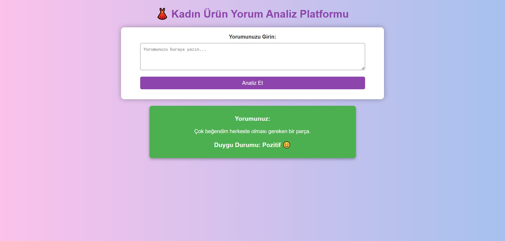
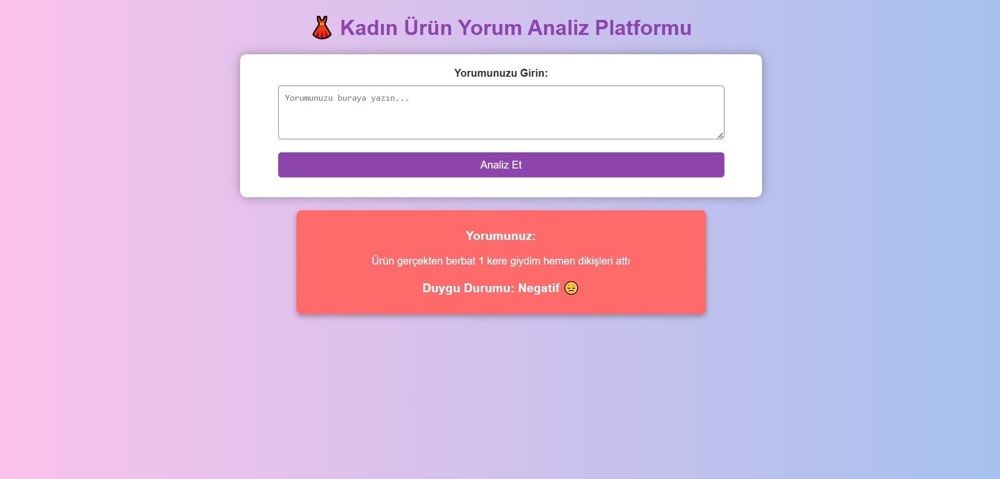
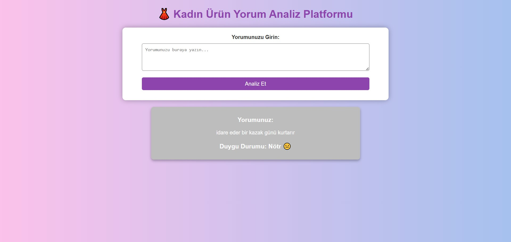

# 👗 Women's Product Review Sentiment Analysis Platform

This project is a **Flask-based web application** designed to perform **sentiment analysis** on women's product reviews. Users can submit their comments about products to instantly analyze whether the sentiment is **Positive 😊**, **Negative 😞**, or **Neutral 😐**.

---

## 🚀 Features

- **Sentiment Analysis**: Detects the sentiment of user comments as **Negative**, **Positive**, or **Neutral**.
- **Color-Coded Results**:  
   - **Positive 😊** → Green box  
   - **Negative 😞** → Red box  
   - **Neutral 😐** → Gray box  
- **User-Friendly Interface**: Modern and easy-to-use design.  
- **Instant Visual Feedback**: Sentiment results are displayed with emojis and meaningful colors.

---

## 📸 Screenshots

### **Positive Result Example**

### **Negative Result Example**

### **Neutral Result Example**

---

## 🛠️ Technologies Used

| Technology       | Description                                      |
|-------------------|--------------------------------------------------|
| **Python**        | Primary programming language                    |
| **Flask**         | Web application framework                       |
| **Transformers**  | BERT model for sentiment analysis               |
| **Torch**         | Deep learning library for model execution       |
| **HTML/CSS**      | Modern and user-friendly interface design       |
